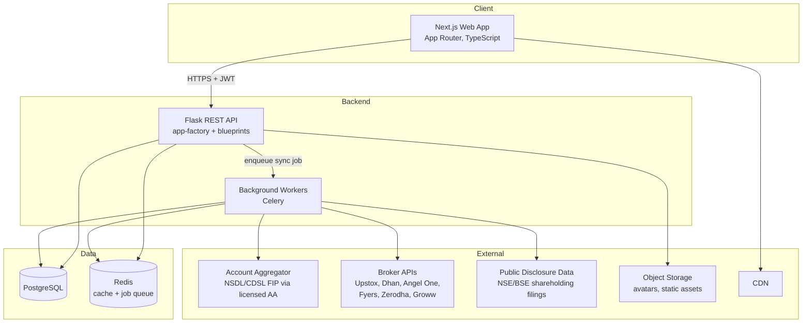
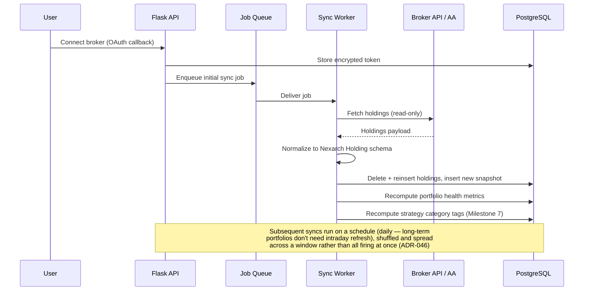

# Architecture

**Last verified: 2026-08-04** — blueprint list, broker adapters and the caching claims were checked against the code. Three statements were wrong and are corrected inline.

**Purpose:** This document describes how Nexarch's systems fit together — the major components, how data flows through them, and the scalability and reliability decisions behind that shape. See [database.md](./database.md) for schema detail and [api.md](./api.md) for the contract between frontend and backend.

---

## System Overview



Frontend and backend are fully decoupled: the Next.js app talks to the Flask API only over versioned REST endpoints (see [api.md](./api.md)), never directly to the database. This keeps the door open to a mobile client later without any backend changes.

**The diagram shows the intended shape, not the built one.** The six brokers in the External subgraph are what the adapter abstraction exists to support; **only Upstox has an adapter on `main`** (`integrations/broker/registry.py` registers `upstox` alone). The Account Aggregator path is likewise designed for and not built. See [CURRENT_STATE.md](./CURRENT_STATE.md) for what actually runs.

## Why This Stack

The frontend and backend choices (Next.js/React/TypeScript/Tailwind, Flask/SQLAlchemy/PostgreSQL) were set at founding and are treated as fixed for Phase 1. Two additions weren't specified up front and are proposed here — logged properly in [decisions.md](./decisions.md) rather than silently assumed:

- **Redis + Celery** for background jobs. Broker sync can't happen inline on a request (it involves outbound calls to third-party APIs that can be slow or rate-limited), so it needs a queue. Redis also serves as the cache layer for computed analytics that don't need to be recalculated on every page view.
- **Alembic** for migrations, since it's the standard companion to SQLAlchemy and there's no reason to hand-roll one.

## Backend Structure

Flask is organized around an app-factory pattern with blueprints per domain, and a service layer between routes and models so business logic doesn't live in either the HTTP layer or the ORM layer:

```
routes/  →  services/  →  models/ (SQLAlchemy)
   ↑            ↓
 schemas/   integrations/ (per-broker adapters, AA client)
(validation)
```

Blueprints, as registered in `create_app()`: `health` (unprefixed), `auth`, `users`, `broker_connections`, `portfolios`, `discovery`, `public_investors` — seven. An earlier revision of this document also listed `strategy_categories`; there is no such blueprint, and never was. `GET /discovery/strategy-categories` is a route on the discovery blueprint, which is the right home for it — it exists to populate a discovery filter. Corrected 2026-08-04.

Each broker (and the AA client) gets its own adapter module under `integrations/broker/` that implements a shared interface — `connect()`, `fetch_holdings()`, `refresh_token()` — so the sync worker doesn't need to know broker-specific details. See [broker-integrations.md](./broker-integrations.md) for why this abstraction matters more than usual here (brokers and the AA framework have genuinely different auth models, not just different field names).

## Data Flow: Portfolio Sync



The scheduled fan-out is **batched and jittered across a configurable window**, not fired simultaneously: broker rate limits are per-application, so enqueuing every connection at 02:00:00 spikes with total users and gets worse precisely as the product succeeds (ADR-046). Because that pipeline's worst failure is *silence* — a dead scheduler raises nothing and leaves every other endpoint green — `GET /health/sync` reports scheduler liveness, worker liveness, recent success and failure rate as four separate checks (ADR-047).

Holdings are normalized into a single internal shape regardless of source (broker API or AA), so the rest of the system — analytics, discovery, public profiles — never needs to know where the data came from. This matters because, per [broker-integrations.md](./broker-integrations.md), the sourcing strategy itself (direct broker API vs. Account Aggregator) is still an open decision, and the rest of the codebase shouldn't be coupled to that choice.

Neither write is a true upsert: Holdings and strategy-category tags are deleted and reinserted every sync (idempotent — a repeat sync reproduces the same rows, never accumulates); `portfolio_snapshots` rows are always inserted, never updated in place (ADR-025 — multiple same-day snapshots are an accepted, intentional state). See ADR-034 in [decisions.md](./decisions.md) for the sync pipeline's retry/idempotency policy and the failure-handling paths this diagram's happy-path view doesn't show.

## Caching Strategy

- Computed portfolio-health metrics (diversification, concentration) are computed **on sync, not on page load** — but they are **persisted in Postgres**, on the `portfolio_snapshots` row, not cached in Redis. An earlier revision of this document said Redis; `analytics_service.py` touches Redis nowhere (verified 2026-08-04). The distinction matters: these are a durable historical record, which is what makes the history and comparison endpoints possible, so a cache with a TTL would be the wrong storage for them. Only `discovery_service`, `price_cache_service`, `refresh_token_service`, `sync_monitor_service` and `broker_connection_service` use Redis.
- Discovery feed queries (filtered/sorted investor lists) are cached with a short TTL, invalidated on new sync completion. Invalidation is a **namespace version bump** — cache keys embed a counter and invalidating increments it in one O(1) command, orphaning every old key at once (ADR-045). It is deliberately *not* a `SCAN`+`DELETE` sweep, which walks the whole Redis keyspace and so charged discovery for however much unrelated data shared the server. Cache reads and writes are also failure-tolerant: an unreachable Redis degrades discovery to uncached rather than returning 500. Only the first few pages are cached — the cache key embeds `page`, which is caller-controlled, so caching every page would let a crawler mint unbounded Redis keys (ADR-038).
- Broker historical price series are cached in Redis, keyed by (instrument, exchange, date range), with a 24-hour TTL (ADR-037). Daily closes for a past window are immutable, so this is safe, and it collapses what used to be one broker call per holding per portfolio per sync into one call per instrument per TTL. Only market data is cached — never holdings or anything user-specific.

**Reading "latest" from an append-only table.** `portfolio_snapshots` grows by one row per sync forever, so anything that wants the *current* state of many portfolios at once (the discovery feed) must ask the database for the latest row per portfolio rather than loading the collection and picking in Python. That's a single ranked query (`ROW_NUMBER() OVER (PARTITION BY portfolio_id ...)`), not an ORM relationship load — see ADR-036 for the measured reason this matters, and `scripts/benchmark_endpoints.py` for the harness that catches it regressing.
- Session/rate-limit counters live in Redis.

## Scalability Plan

MVP does not need to be over-engineered for scale it doesn't have yet, but the shape should not block it later:
- API layer is stateless (JWT, no server-side session) so it scales horizontally behind a load balancer without extra work.
- Sync workers are decoupled via the queue, so broker-sync volume scales independently of API traffic — important because broker API rate limits (see [broker-integrations.md](./broker-integrations.md)) mean sync throughput will be the actual bottleneck long before the API layer is.
- PostgreSQL read replicas are a Phase 2+ concern once discovery-feed read volume actually justifies it — not a Phase 1 concern.

## Environments

- **Local:** Docker Compose for Postgres + Redis; frontend and backend run natively for fast iteration.
- **Staging:** mirrors production topology at smaller scale, used for broker-integration testing against sandbox credentials where brokers provide them (Upstox does; not all do — see [broker-integrations.md](./broker-integrations.md)).
- **Production:** Vercel (frontend), Railway (backend + workers + Postgres + Redis) — confirmed in ADR-040, which settles the earlier "Railway or AWS" open question. API and sync worker run from one container image (`apps/api/Dockerfile`) differing only in start command, served by gunicorn. **Not yet provisioned** — the deploy pipeline exists and has never been executed. See [operations.md](./operations.md).

Configuration is validated at startup in production (ADR-039): the app refuses to boot if `JWT_SECRET`, `ENCRYPTION_KMS_KEY_ID`, `DATABASE_URL`, or `REDIS_URL` is missing, empty, or a placeholder. Deployment, rollback, backup/restore, secret rotation, and incident response are all documented in [operations.md](./operations.md).

## Open Architectural Questions

Recorded here rather than silently resolved, because each has a real tradeoff:
1. Direct broker-by-broker integration vs. Account Aggregator as the primary sync path — see [broker-integrations.md](./broker-integrations.md).
2. Whether portfolio "volatility" (as opposed to point-in-time diversification/concentration) is even computable from holdings snapshots alone, or requires a market-data vendor — see [database.md](./database.md) and ADR-008 in [decisions.md](./decisions.md).
3. State management on the frontend isn't specified in the founding brief. Proposed default: React Query (or SWR) for server state, plain React state/Context for local UI state — no global client-state library needed at this scale. Logged as ADR-009.
