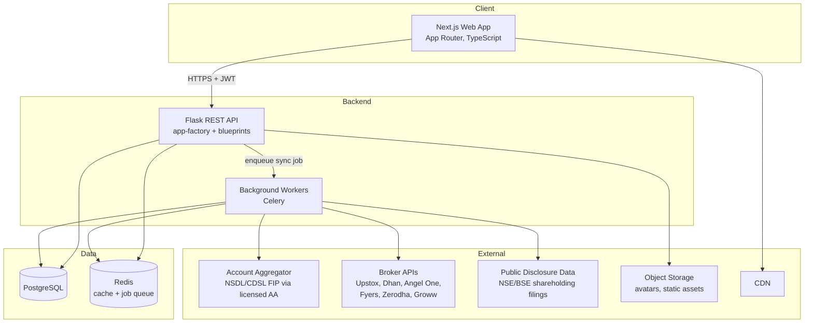
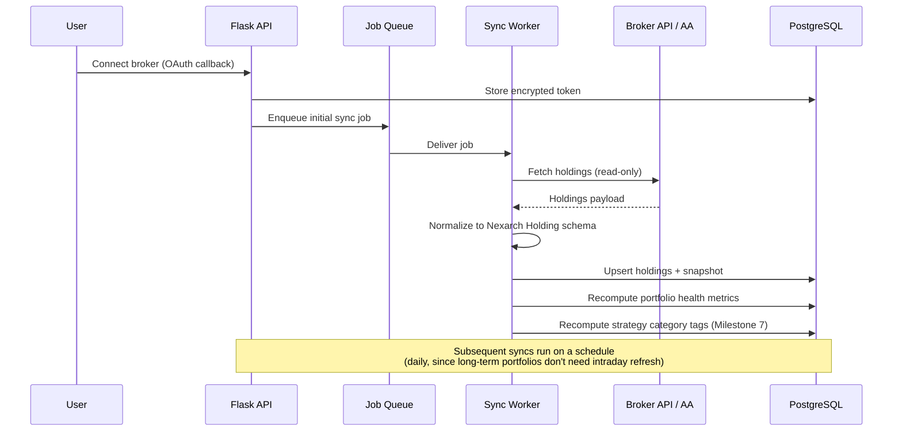

# Architecture

**Purpose:** This document describes how Nexarch's systems fit together — the major components, how data flows through them, and the scalability and reliability decisions behind that shape. See [database.md](./database.md) for schema detail and [api.md](./api.md) for the contract between frontend and backend.

---

## System Overview



Frontend and backend are fully decoupled: the Next.js app talks to the Flask API only over versioned REST endpoints (see [api.md](./api.md)), never directly to the database. This keeps the door open to a mobile client later without any backend changes.

## Why This Stack

The frontend and backend choices (Next.js/React/TypeScript/Tailwind, Flask/SQLAlchemy/PostgreSQL) were set at founding and are treated as fixed for Phase 1. Two additions weren't specified up front and are proposed here — logged properly in [decisions.md](./decisions.md) rather than silently assumed:

- **Redis + Celery** for background jobs. Broker sync can't happen inline on a request (it involves outbound calls to third-party APIs that can be slow or rate-limited), so it needs a queue. Redis also serves as the cache layer for computed analytics that don't need to be recalculated on every page view.
- **Alembic** for migrations, since it's the standard companion to SQLAlchemy and there's no reason to hand-roll one.

## Backend Structure

Flask is organized around an app-factory pattern with blueprints per domain, and a service layer between routes and models so business logic doesn't live in either the HTTP layer or the ORM layer:

```
routes/  →  services/  →  models/ (SQLAlchemy)
   ↑            ↓
 schemas/   integrations/ (per-broker adapters, AA client)
(validation)
```

Blueprints: `auth`, `users`, `portfolios`, `broker_connections`, `discovery`, `public_investors`, `strategy_categories`. Each broker (and the AA client) gets its own adapter module under `integrations/broker/` that implements a shared interface — `connect()`, `fetch_holdings()`, `refresh_token()` — so the sync worker doesn't need to know broker-specific details. See [broker-integrations.md](./broker-integrations.md) for why this abstraction matters more than usual here (brokers and the AA framework have genuinely different auth models, not just different field names).

## Data Flow: Portfolio Sync



Holdings are normalized into a single internal shape regardless of source (broker API or AA), so the rest of the system — analytics, discovery, public profiles — never needs to know where the data came from. This matters because, per [broker-integrations.md](./broker-integrations.md), the sourcing strategy itself (direct broker API vs. Account Aggregator) is still an open decision, and the rest of the codebase shouldn't be coupled to that choice.

## Caching Strategy

- Computed portfolio-health metrics (diversification, concentration) are cached in Redis and recomputed on sync, not on every page load.
- Discovery feed queries (filtered/sorted investor lists) are cached with a short TTL, invalidated on new sync completion for affected portfolios.
- Session/rate-limit counters live in Redis.

## Scalability Plan

MVP does not need to be over-engineered for scale it doesn't have yet, but the shape should not block it later:
- API layer is stateless (JWT, no server-side session) so it scales horizontally behind a load balancer without extra work.
- Sync workers are decoupled via the queue, so broker-sync volume scales independently of API traffic — important because broker API rate limits (see [broker-integrations.md](./broker-integrations.md)) mean sync throughput will be the actual bottleneck long before the API layer is.
- PostgreSQL read replicas are a Phase 2+ concern once discovery-feed read volume actually justifies it — not a Phase 1 concern.

## Environments

- **Local:** Docker Compose for Postgres + Redis; frontend and backend run natively for fast iteration.
- **Staging:** mirrors production topology at smaller scale, used for broker-integration testing against sandbox credentials where brokers provide them (Upstox does; not all do — see [broker-integrations.md](./broker-integrations.md)).
- **Production:** Vercel (frontend), Railway or AWS (backend + workers + Postgres + Redis).

## Open Architectural Questions

Recorded here rather than silently resolved, because each has a real tradeoff:
1. Direct broker-by-broker integration vs. Account Aggregator as the primary sync path — see [broker-integrations.md](./broker-integrations.md).
2. Whether portfolio "volatility" (as opposed to point-in-time diversification/concentration) is even computable from holdings snapshots alone, or requires a market-data vendor — see [database.md](./database.md) and ADR-008 in [decisions.md](./decisions.md).
3. State management on the frontend isn't specified in the founding brief. Proposed default: React Query (or SWR) for server state, plain React state/Context for local UI state — no global client-state library needed at this scale. Logged as ADR-009.
