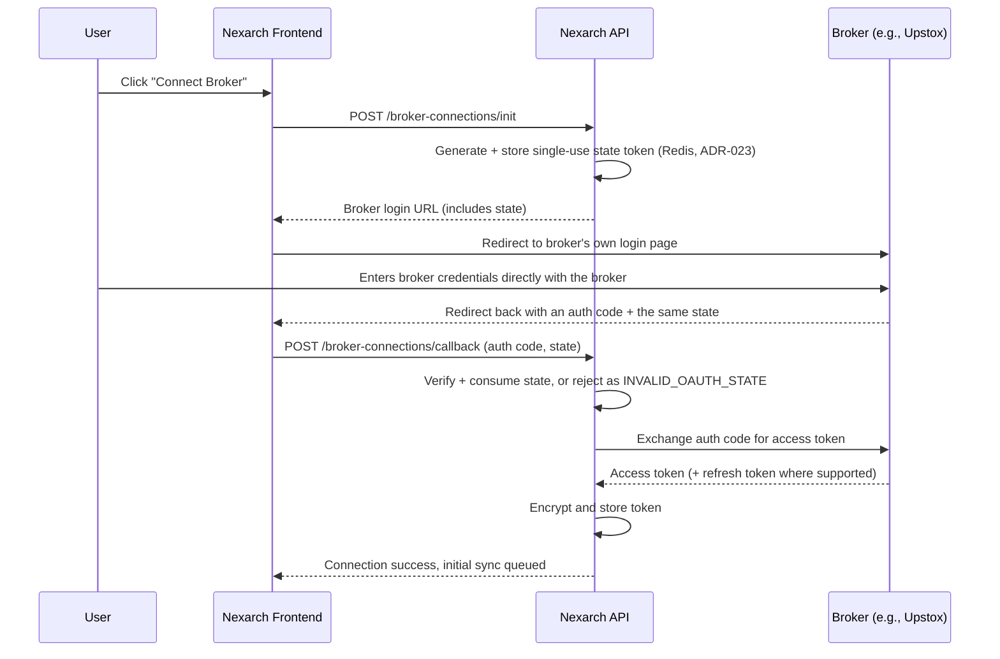

# Broker Integrations

**Purpose:** This document covers how Nexarch connects to brokerage accounts to sync holdings — supported brokers, auth flows, data mapping, refresh strategy, and security. This is the most research-dependent document in the set, because broker API availability and terms are exactly the kind of thing that changes between when a concept note is written and when code gets built. **Everything below was checked against current sources in July 2026** rather than assumed; broker terms should be re-verified again before signing any integration agreement, since this space moves fast.

---

## The Single Most Important Decision in This Document

Before picking brokers one by one, there's a broker-agnostic path worth taking seriously as the *primary* strategy: **the RBI Account Aggregator (AA) framework.**

As of 2026, both NSDL and CDSL are live, SEBI-specified Financial Information Providers (FIPs) for the securities market on the AA network. In practice, this means:
- A user can consent, through any RBI-licensed Account Aggregator (e.g., Setu, Finvu, OneMoney, CAMS Finserv/Perfios, Anumati, NADL), to share their demat holdings — profile, holdings summary across equities and mutual funds, and transaction history — with a registered Financial Information User (FIU).
- This works **regardless of which broker or DP the user's demat account sits with.** A Groww user, an ICICI Direct user, and a Zerodha user all route through the same depository-level consent flow, because the depository (not the broker) is the FIP.
- It's the standardized, RBI/SEBI-blessed path for exactly this kind of consented data sharing — as opposed to a patchwork of bespoke integrations, each with its own developer terms, pricing, and (as below) redistribution restrictions.

**Trade-off:** integrating as an FIU (directly, or through a TSP that already holds FIU status) has its own onboarding and compliance overhead, and the data shape/refresh cadence is standardized rather than broker-optimized. Recommendation logged as ADR-010 in [decisions.md](./decisions.md): **evaluate AA integration in parallel with the first direct-broker integration in Phase 1**, rather than committing fully to one path before testing both. Direct broker APIs may still be worth keeping as a complementary path — the AA framework gives a static, consented pull; a broker's own API may offer richer or more frequent data for users who prefer to connect that way.

## Broker-by-Broker Status (as verified July 2026)

| Broker | Public API? | Holdings Endpoint | Cost | Auth Model | Notes |
|---|---|---|---|---|---|
| **Upstox** | Yes | `GET /v2/portfolio/long-term-holdings` | Free for the Interactive/portfolio API | OAuth redirect; a special **analytics token** can be generated once and doesn't need daily re-auth (unlike the standard token) — ideal for background sync | Best fit for a low-friction Phase 1 pilot |
| **Dhan (DhanHQ)** | Yes | `GET /v2/holdings` | Free, no monthly charge, 20,000 req/day | Consent-based login flow (`DhanLogin`), access token per session | Well-documented, generous rate limit |
| **Angel One (SmartAPI)** | Yes | Holdings/positions/margins endpoints | Free | API key + TOTP-based login | Popular with the algo-trading dev community; good docs |
| **Fyers** | Yes | Holdings via Fyers API v2/v3 | Free tier available | OAuth-style | Established, but re-verify current terms before integrating |
| **Groww** | Yes — **launched its own API in 2025** | Holdings/portfolio via `growwapi` (Python/REST) | **₹499/month, paid by the end user directly to Groww** (not by Nexarch) | User self-generates an API key + access token from within their own Groww account settings — not a redirect-based OAuth login | The pricing is a real adoption barrier: asking a user to pay Groww ₹499/month just so Nexarch can read their portfolio is a meaningfully different ask than "click connect." Worth testing conversion before assuming Groww support at parity with free-API brokers. |
| **Zerodha (Kite Connect)** | Yes | Holdings/positions/funds included in the **free "Personal" plan** | Free for holdings/portfolio/orders; ₹500/month per API key only for live/historical market data | OAuth redirect (request_token → access_token exchange) | **See the flag below — this one needs a direct conversation with Zerodha before public profiles go live.** |
| **ICICI Direct, HDFC Sky, Kotak Neo** | Some have APIs (e.g., ICICI Direct's Breeze API) | Not verified in this pass | Varies | Varies | Deprioritized to Phase 2+ per the founding scope, which only lists Zerodha/Upstox/Angel One/Groww/Dhan/Fyers for initial architecture — consistent with this table |

## ⚠️ Open Risk: Data Redistribution Terms

Zerodha's own Kite Connect documentation states plainly: *"Displaying or redistributing Kite Connect API data on external platforms violates exchange data vending policies. Kite Connect is an order execution platform, not a data distribution service."*

This is a genuine open question, not a solved one, and it should be resolved with a direct conversation with each broker (starting with Zerodha, given the explicit language) before Nexarch displays a user's *own* synced holdings back to *other* users on a public profile — which is the entire point of the product. It's likely that a user choosing to share their own account's data on their own profile is a different situation from a third party redistributing broker-sourced market data to build a competing data service, but "likely" is doing a lot of work in that sentence and this shouldn't be assumed away. This is exactly the kind of thing worth a targeted conversation with each broker's platform/BD team, or securities counsel, before launch — not a blocker to building the sync architecture now, but a real blocker to flipping "public" on by default. Logged as an open item in [decisions.md](./decisions.md) and [security.md](./security.md).

## Auth Flow (Broker API Path)

The `state` round-trip (ADR-023) is what stops the callback from accepting a tampered-with or replayed redirect — a bare auth-code exchange authenticated only by the caller's JWT doesn't prove *this specific* connect attempt is the one the JWT-holder actually initiated.

The user's broker password never reaches Nexarch in this flow — only the exchanged token does. Groww's model differs (the user generates a token in their own Groww settings and pastes/authorizes it), which needs its own slightly different UI flow, documented per-adapter rather than forced into the same screen as the redirect-based brokers.

## Data Mapping

Each broker/AA adapter normalizes its response into the shared `Holding` shape from [database.md](./database.md): `symbol`, `isin`, `exchange`, `quantity`, `avg_cost_price`, `sector` (enriched from a separate sector-mapping reference, since brokers don't reliably provide this), `market_cap_category`. ISIN is the most reliable join key across sources since trading symbols occasionally differ between NSE and BSE listings of the same security.

## Refresh Strategy

- **Scheduled:** daily sync per connected portfolio — long-term holdings don't need intraday freshness, and daily sync respects broker rate limits by design rather than by accident.
- **Manual:** a rate-limited "sync now" button, since users will reasonably want to refresh after making a trade.
- **Token expiry handling:** several brokers (notably Kite Connect's standard access token) expire daily by broker design. The sync worker needs to detect an expired-token failure distinctly from other errors and surface a clear "reconnect your broker" prompt, rather than silently failing or retrying into a rate-limit issue. Upstox's analytics token and the AA consent model both avoid this problem for the read-only use case — another point in favor of preferring them where available.

## Webhooks — Future

Not all brokers support push notifications for portfolio changes; poll-based sync is the realistic Phase 1 approach. Revisit if/when broker webhook support (or AA-side push) becomes reliably available across enough of the supported broker set to be worth the added complexity.

## Security

- Tokens encrypted at rest (see [security.md](./security.md) for the encryption approach).
- Tokens scoped to read-only where the broker's permission model supports scoping.
- Every connect/disconnect/sync/error event written to `audit_logs` (see [database.md](./database.md)).
- Sync jobs back off on broker rate-limit responses rather than retrying immediately.
- No scraping, ever, of any broker's app or website for a broker without a public API. If a broker doesn't expose one, the answer is CAS upload (see below), the AA framework, or waiting — not reverse engineering a private interface. This was a live concern before Groww shipped a public API in 2025; the principle stays even though that specific case resolved itself.

## Fallback Path: CAS Upload

Independent of both the AA framework and broker APIs, India's depositories issue a **Consolidated Account Statement (CAS)** — a monthly PDF covering all holdings across all of a user's demat accounts for a given PAN. Several existing portfolio trackers (INDmoney, MProfit, and others per [product/competitor-analysis.md](./product/competitor-analysis.md)) already support CAS upload/parsing as a broker-agnostic import method, particularly for mutual funds. This is worth keeping as a manual fallback for any broker where neither a direct API nor AA coverage is available yet, even though it can't power the "live verified sync" badge the same way an authenticated connection can — a CAS-imported portfolio is closer to the Public Investor Library's "point-in-time from a document" model than to a continuously verified one, and the UI should be honest about that distinction rather than blur it.
