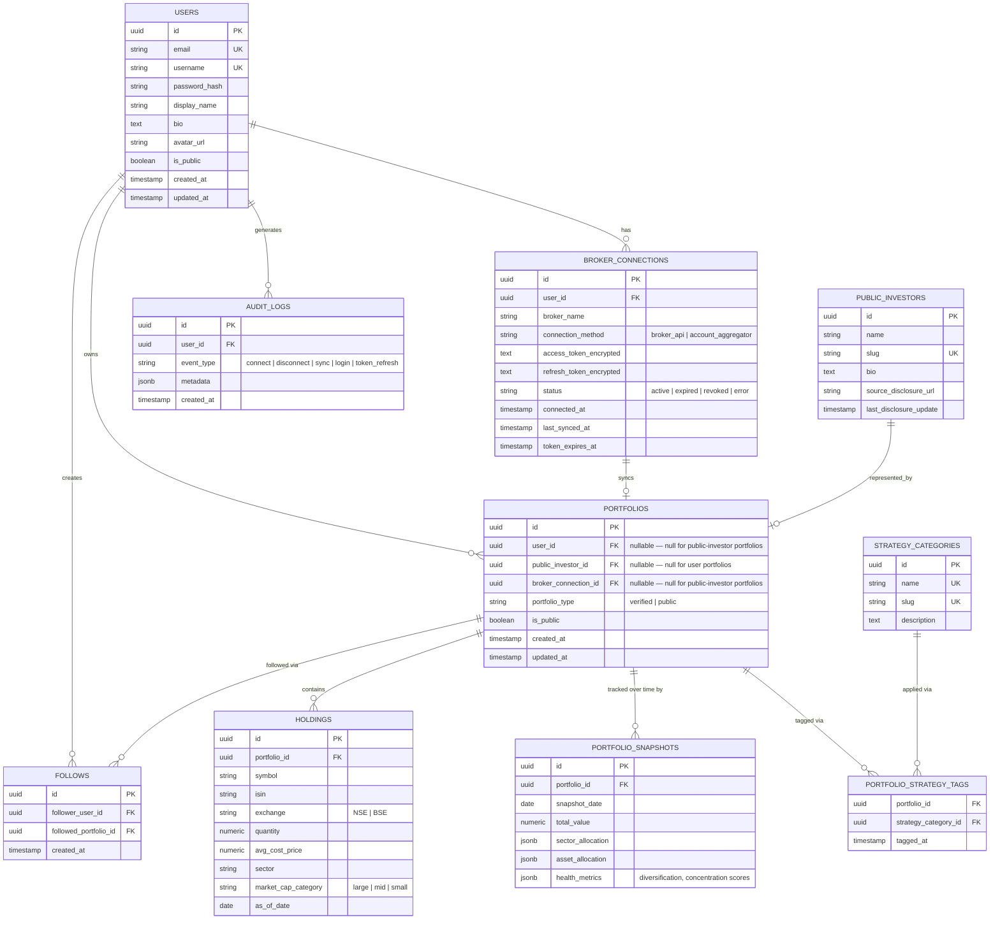

# Database

**Purpose:** This document is the source of truth for the Nexarch schema — entities, relationships, indexing, and how the schema is expected to evolve across phases. Implementation should follow this document; if implementation needs to diverge, update this document in the same PR. See [architecture.md](./architecture.md) for how these tables get populated, and [api.md](./api.md) for how they're exposed.

---

## Entity-Relationship Diagram



## Design Notes

**Why `portfolios` has two nullable FK "owners" (`user_id` / `public_investor_id`):** a portfolio either belongs to a real user (verified, broker-synced) or represents a Public Investor Library entry (curated from disclosures) — never both. This is enforced at the application layer with a check constraint (`portfolio_type = 'verified' AND user_id IS NOT NULL AND public_investor_id IS NULL`, or the mirror image for `'public'`). An alternative would be two separate tables (`verified_portfolios`, `public_portfolios`), but that would duplicate the holdings/snapshot/strategy-tag relationships twice for no real benefit, since downstream code (analytics, discovery feed) treats both identically once loaded. Logged as ADR-006 in [decisions.md](./decisions.md).

**Why holdings are point-in-time, not a running ledger:** `holdings` reflects the *current* synced state (overwritten on each sync); `portfolio_snapshots` is the append-only history used for "portfolio age," "historical changes," and trend charts. This avoids needing full transaction-level data (buys/sells) that most broker read-APIs don't cleanly expose anyway — see [broker-integrations.md](./broker-integrations.md).

**Why `strategy_categories` is a join table, not a single `strategy` column on `portfolios`:** a portfolio can plausibly be both "Value Investing" and "Long-Term Compounder" at once — see the strategy list in [product-requirements.md](./product-requirements.md). A single-value column would force a false choice.

**What's deliberately not in this schema yet:**
- No `orders` or `trades` tables — those belong to Phase 5 (execution) and shouldn't exist until that phase is actually being built, to avoid unused schema surface area.
- No `subscriptions` / billing tables — Phase 4 (Creator Economy).
- No `notifications` table — explicitly out of MVP scope per [roadmap.md](./roadmap.md).
- No `follows`-adjacent activity feed / comments tables — same reason.

## Public Investor Example (Illustrative Only)

To be concrete about what a `public_investors` + `holdings` row pair looks like without attaching invented numbers to a real person's name, here's a fictional example for schema illustration:

```
public_investors: { name: "Ramesh Iyer" (fictional), slug: "ramesh-iyer",
                     source_disclosure_url: "<NSE/BSE shareholding filing link>" }
portfolios:        { public_investor_id: <above>, portfolio_type: "public", is_public: true }
holdings:          { symbol: "EXAMPLECO", quantity: 500000, sector: "Financials", as_of_date: "2026-06-30" }
```

Real Public Investor Library entries (Radhakishan Damani, Ashish Kacholia, Vijay Kedia, Dolly Khanna, Mukul Agrawal, per [vision.md](./vision.md)) must be populated only from actual, dated, cited public shareholding disclosures — never estimated or inferred. `source_disclosure_url` and `last_disclosure_update` exist specifically so every public-investor holding is traceable to a real filing, not a guess. This is both a data-integrity requirement and, given SEBI's current scrutiny of unverified market claims (see [security.md](./security.md)), a compliance one.

## Indexing Strategy

| Table | Index | Reason |
|---|---|---|
| `users` | unique(`email`), unique(`username`) | login lookup, profile URL lookup |
| `broker_connections` | (`user_id`) | one user's connections |
| `portfolios` | (`user_id`), (`public_investor_id`), (`is_public`) | ownership lookup, discovery-feed filtering |
| `holdings` | (`portfolio_id`), (`sector`) | portfolio detail page, sector-based discovery |
| `portfolio_snapshots` | composite (`portfolio_id`, `snapshot_date`) | time-series queries for history charts |
| `portfolio_strategy_tags` | composite (`portfolio_id`, `strategy_category_id`) | many-to-many lookups both directions |
| `public_investors` | unique(`slug`) | public profile URL |
| `follows` | unique(`follower_user_id`, `followed_portfolio_id`) | prevent duplicate follows, fast "am I following" check |
| `audit_logs` | (`user_id`, `created_at`) | security review, support debugging |

## Migrations

Alembic, one migration per schema change, never edited after being merged to main — a correction is a new migration, not an edit to history. Migration files live in `apps/api/migrations/` (see [development-guide.md](./development-guide.md) for the full folder layout).

## Future Schema Evolution

- **Phase 2:** likely additions to `portfolio_snapshots.health_metrics` once a market-data vendor is selected for true volatility (see ADR-008).
- **Phase 4:** `subscriptions`, `creator_payouts`.
- **Phase 5:** `orders`, `trades`, and a much closer look at reconciliation between Nexarch's records and the broker's, since execution data has to be authoritative in a way read-only sync doesn't.
