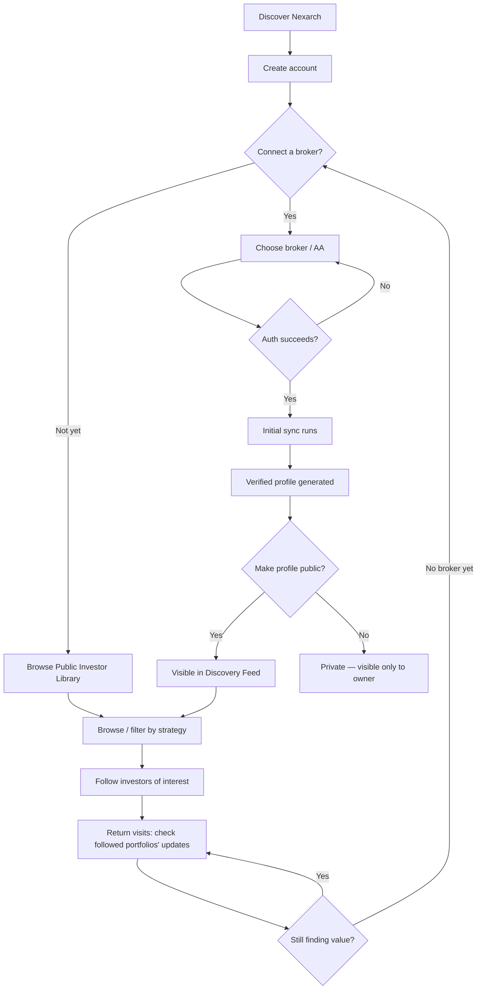

# User Journey

**Purpose:** The step-by-step flow from first visit to established habit, including the failure/edge paths that a happy-path-only journey map tends to hide. Expands the 7-step journey from the founding concept note into implementation-relevant detail. See [product-requirements.md](../product-requirements.md) for the acceptance criteria behind each step.

---

## Step-by-Step Detail

### 1. Discover Nexarch
Most likely paths at launch: word of mouth in existing DIY-investor communities, or organic search for "verified investor portfolios India" once the Public Investor Library has SEO value. See [go-to-market.md](./go-to-market.md).

### 2. Create Account
Standard email/password registration (see [api.md](../api.md)). No broker connection required to create an account — the Public Investor Library needs to be explorable without any commitment, both to solve cold-start and because forcing a broker connection before any value is shown is a real drop-off risk.

### 3. Connect a Broker (optional at this stage)
A user can defer this indefinitely and still get value from browsing. When they do connect, see [broker-integrations.md](../broker-integrations.md) for the auth flow, which differs slightly by broker/AA path.

**Failure path:** if auth fails (wrong credentials at the broker, user cancels mid-flow, broker API error), the user returns to a clear retry state — not a dead end, and not a confusing partial `broker_connections` record left in an ambiguous status.

### 4. Initial Sync
Runs immediately on successful connection (not on the next scheduled cycle — see [product-requirements.md](../product-requirements.md) acceptance criteria). User sees a loading/skeleton state (see [design-system.md](../design-system.md)) rather than a blank page during this window.

### 5. Verified Profile Generated
Badge, holdings, allocation, and health metrics appear. Portfolio age is computed from historical snapshot data where available, not just "time since connected" — a user who's held a position for years shouldn't have their portfolio read as brand-new just because they connected Nexarch today. This matters especially for a persona like Rohan (see [user-personas.md](./user-personas.md)), whose entire value proposition is a multi-year track record.

### 6. Public/Private Decision
Private by default (see [product-requirements.md](../product-requirements.md)). This is a genuine, unhurried decision point in the UI, not a checkbox buried in settings — given the broker data-vending question still open in [decisions.md](../decisions.md) ADR-011, this step also needs to reflect whatever resolution comes out of that conversation before it ships broadly.

### 7. Browse Discovery Feed / Public Investor Library
Available at any point in the journey, including before step 3. Filterable by strategy category.

### 8. Follow Investors
No capital or execution relationship — see [product-requirements.md](../product-requirements.md) "Following" acceptance criteria for why this is stated explicitly rather than assumed obvious.

### 9. Return Visits
This is the loop that needs to work for retention, and it's honestly the least-specified part of the founding brief, because notifications and activity feeds are explicitly out of MVP scope (see [roadmap.md](../roadmap.md)). For Phase 1, the return-visit hook is simply: followed portfolios show updated holdings/health metrics on next sync, visible the next time the user opens the app — a pull-based loop rather than a push-based one (no notification pings), which is consistent with staying out of the "Notifications" MVP exclusion while still giving a reason to come back. Worth flagging as a retention risk to watch in [success-metrics.md](./success-metrics.md) rather than assuming it's sufficient.

## Where This Journey Currently Has Open Questions

- Whether a first-time visitor with no account yet can browse the Public Investor Library at all before registering, or whether registration is a hard gate — recommend **no gate**, since the Public Investor Library's whole value as a cold-start solution depends on it being immediately explorable, but this is a product call for the founder, not something to assume settled by this document alone.
- What happens to a user's public profile and follower relationships if they disconnect their only broker — does the profile go dark, get archived, or stay visible as stale/dated data? Needs a decision before Phase 1 ships, logged once resolved in [decisions.md](../decisions.md).
