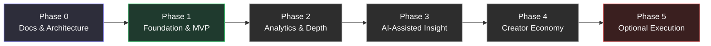

# Roadmap

**Purpose:** This is the phase-by-phase plan from MVP to long-term vision — what gets built, in what order, and just as importantly, what is explicitly *not* being built yet and why. See [feature-backlog.md](./product/feature-backlog.md) for ticket-level detail within each phase, and [decisions.md](./decisions.md) for the reasoning behind sequencing calls.

**This document owns the future.** For where the project actually stands today — what's blocked, what's next, today's test and CI results — see [CURRENT_STATE.md](./CURRENT_STATE.md). Phase completion markers here were audited against the implementation on 2026-08-04.

---

## How to Read This

Each phase has a goal, not just a feature list. A phase is "done" when its goal is demonstrably true, not when every listed item is checked off — some items will move between phases as we learn more, and that's expected and fine as long as it's recorded in [decisions.md](./decisions.md).

---

## Phase 0 — Architecture & Documentation *(done)*

**Goal:** Nobody writes application code against an undocumented, unreviewed plan.

- Full `/docs` knowledge base (this folder)
- Database schema design
- API contract design
- Broker/AA integration strategy, including the open risks
- Founder sign-off on the decisions in [decisions.md](./decisions.md)

**Exit criteria:** Founder approves the schema, the broker-integration approach, and the list of open compliance questions — explicitly, before Phase 1 branches are opened.

## Phase 1 — Foundation & MVP

**Goal:** A user can connect one broker, get a verified badge, and see their own profile — and can browse the Public Investor Library even before any community adoption exists (solves cold start).

In scope:
- Auth (register/login, JWT access + refresh)
- Database + migrations for the core schema
- Broker connection architecture for **one** broker first (recommend starting with Upstox — free API, no daily token re-auth; see the broker comparison table in [broker-integrations.md](./broker-integrations.md)), built in a way that a second and third broker are additive, not a rewrite
- Verified profile generation from synced holdings
- Public Investor Library (seeded from public disclosures, manually curated at this stage)
- Discovery feed v1 (browse investors, basic filters)
- Portfolio pages with basic analytics (allocation, sector split)
- Responsive UI, dark mode

Explicitly excluded from Phase 1 (per founding scope, restated so it doesn't quietly creep in):
- Trade execution
- Copy trading
- AI assistants
- Subscriptions / paid tiers
- Notifications
- Chat / DMs
- Community posts / comments
- Enterprise features

**Exit criteria:** A real user can go from signup to a public, verified profile with holdings visible, end to end, with one broker.

## Phase 2 — Advanced Analytics & Comparisons

**Goal:** Discovery becomes genuinely useful, not just a directory. **The goal was met and the phase closed** — but two listed items were not delivered, marked below rather than quietly dropped (audited 2026-08-04).

- **Deeper portfolio-health metrics** *(done — ADR-024)*. The market-data dependency for volatility was resolved here (see [database.md](./database.md)).
- **Portfolio comparison, side-by-side** *(done — ADR-026/027)*.
- **Strategy categorization**, rules-based, not ML *(done — ADR-028)*.
- **Additional broker integrations** *(built, **not on `main`**)*. A Dhan adapter exists as commit `81f5e20` on the local branch `feature/milestone-8-dhan-broker`, which is unmerged and unpushed — so the deployable state supports exactly one broker, Upstox. Needs a founder decision: merge, or move to future work. See [TECHNICAL_DEBT.md](./TECHNICAL_DEBT.md) B2.
- **Watchlists** (follow without needing an account relationship) *(**not built**)*. `grep -r watchlist apps/api/app` returns nothing. Follows shipped in Phase 1 and cover most of the need, which is why the phase closed on its goal without this — per this document's own rule that a phase is done when its goal is demonstrably true, not when every item is ticked. Open question: are watchlists meaningfully different from follows? If not, strike the line.

## Phase 2.5 — Production Hardening

**Goal:** Close the gap between what the docs claimed and what the code actually did, before adding more surface area (Account Aggregator, additional brokers) on top of it. Sequenced as five focused slices rather than one undifferentiated cleanup pass:

1. **Security & API** *(done — see [decisions.md](./decisions.md) ADR-029 through ADR-033)*: every failure path returns the documented response envelope; refresh-token rotation with family-based reuse detection; CSRF protection actually enabled (previously documented as if it were); rate limiting actually implemented (previously documented as if it were); a real database-level backstop for one-broker-connection-per-user; `GET /users/me/following` paginated like every other list endpoint; `/portfolios/compare`'s query parsing moved onto the same schema convention every other endpoint uses.
2. **Reliability** *(done — see [decisions.md](./decisions.md) ADR-034)*: sync-pipeline retry policy (rate-limit failures retry with backoff; token-expiry and unexpected errors don't); every sync failure path now consistently sets connection status, logs, and audit-logs (previously the most common failure class was silent); the daily scheduled sync no longer permanently drops a connection after one transient failure; `task_acks_late`/`task_reject_on_worker_lost` so a worker crash mid-sync doesn't lose the job forever; structured JSON logging with request-id correlation; `GET /health` and `GET /health/ready` endpoints. External alerting/APM deliberately deferred to the Deployment slice below, once a real hosting decision exists to tie it to.
3. **Performance & Database** *(done — see [decisions.md](./decisions.md) ADR-035 through ADR-038)*: the discovery feed no longer loads every portfolio's entire snapshot history to read one number (589 ms → 82 ms, and no longer growing with history); latest-snapshot reads are one ranked query; index changes justified by `EXPLAIN ANALYZE` at realistic volume, including dropping one that served no query; broker historical-price fetches de-duplicated, cached, and bounded-parallel; opt-in pagination for the two previously-unbounded collections; a reproducible benchmark harness (`scripts/benchmark_endpoints.py`) and query-shape regression tests. Also fixed a real correctness bug found on the way: discovery and analytics could disagree about a portfolio's latest health.
4. **Deployment & Operations** *(done — see [decisions.md](./decisions.md) ADR-039 through ADR-043)*: production now refuses to start on unsafe configuration — it previously booted with an empty JWT signing secret and issued forgeable tokens; CI (lint/typecheck/test/build against real Postgres and Redis) enforcing what `development-guide.md` had claimed since Phase 0 but nothing implemented; containerised Railway deploy with migrations run before traffic cutover; Sentry wired but inert until a DSN is set; backup/restore scripts with a restore drill that has actually been executed; and the secret-rotation runbook [security.md](./security.md) flagged as missing — including the honest finding that `ENCRYPTION_KMS_KEY_ID` cannot currently be rotated without breaking every broker connection. See [operations.md](./operations.md).

5. **Review Fixes & Operational Hardening** *(done — see [decisions.md](./decisions.md) ADR-044 through ADR-047)*: closes the engineering review. Login no longer leaks whether an email is registered through response timing (measured 122x, now 1.08x); `ENCRYPTION_KMS_KEY_ID` is rotatable with zero user reconnects, verified by executing a rotation and then removing the old key; `GET /health/sync` makes a stopped scheduler or stalled worker observable, since the sync pipeline's worst failure is silence; the daily sync is spread across a window instead of firing every connection at once; discovery cache invalidation is O(1); and a latent production 500 on every broker *reconnect* — an enum value missing since Milestone 2 — was caught by CI's first run against real Postgres.

**Phase 2.5 is complete. The project state is now: Beta Candidate.**

Engineering hardening stops here deliberately. What remains before real users is operational, not architectural, and most of it cannot be done from a repository:

1. Merge the remaining PRs.
2. Provision Railway and Vercel (and Sentry, if error tracking is wanted from day one).
3. Perform the first real deployment.
4. Execute the production checklist in [operations.md](./operations.md).
5. Invite a handful of trusted beta users.
6. Collect real-world feedback **before** adding more features.

**Explicitly blocked, not skipped:**
- **The deployment rehearsal** (migrations against production, rollback, first deploy, health verification under real traffic) is **blocked until the deployment environment exists**. Migrations, Docker startup, graceful shutdown, and the backup/restore drill have all been exercised locally; an actual deploy cannot be rehearsed against infrastructure that hasn't been provisioned, and a runbook step nobody has run is exactly what this phase existed to eliminate.
- **Provisioning itself** — accounts, payment details, and real secret values are the founder's to create and hold. Every config, workflow, script, and runbook that consumes them is written and waiting.

Beta launch follows this phase, not Account Aggregator or additional-broker work.

## Frontend — Design System & Landing Page *(done — ADR-048 through ADR-050)*

**Goal:** a beta invitee's first two impressions — the page they land on and the dashboard they reach — should look like one product built by one team.

This is presentation work that runs alongside the operational list above, not a reopening of engineering hardening and not new product surface. No backend, API, routing, auth or business logic changed. Two things were done:

1. **The product UI was rebuilt onto composition primitives** (ADR-048). Every route previously defined its own shell, card, heading and metric styling, so no two shared a column width or a type scale — page titles topped out at 20px while section headings rendered smaller and dimmer than their own body text. Five duplicate components were deleted. The signature element, the Portfolio Identity Strip, renders **nothing** when allocation data is absent rather than falling back to an equal-weight shape: on a product whose whole claim is that what you see is what someone actually holds, an invented composition is worse than an absent element. [design-system.md](./design-system.md) also lists the four backend fields currently blocking specific UI.
2. **A marketing landing page was recreated from a Figma source** (ADR-049, ADR-050). A WCAG audit of the spec itself found seven contrast failures — the primary call to action was white on the accent fill at **2.60:1** — each corrected against a measured ratio rather than an eyeballed one. Two content decisions overrode the spec deliberately: sample records naming real public figures became clearly fictional ones, and a broker Nexarch doesn't integrate was removed from a line asserting verification.

What this did **not** do: it did not close the UI debt listed at the end of [design-system.md](./design-system.md), and it did not touch the four missing backend fields that block the highest-value placements.

## Phase 3 — AI-Assisted Insight

**Goal:** Help users understand *why* a portfolio looks the way it does, without ever telling them what to do with that understanding.

- AI-generated, strictly descriptive portfolio explanations ("this portfolio has historically concentrated in financials and IT" — never "you should...")
- Personalized discovery recommendations (find investors similar to ones you already follow)
- Investment assistant — scoped narrowly to *education about the data on the platform*, not general advice; this is the feature most likely to drift into SEBI Research-Analyst / Investment-Adviser territory if not scoped carefully at design time, not just at copy-review time

## Phase 4 — Creator Economy

**Goal:** Verified investors can monetize credibility without Nexarch or its creators quietly becoming an unregistered advisory business.

- Premium subscriptions (platform-level)
- Creator monetization (premium profile access, research, communities)
- Platform commission model

**Hard gate before this phase ships:** legal review of the "exclusive research" and "subscription-based insights" mechanics against SEBI's Research Analyst Regulations, 2014 and Investment Adviser Regulations, 2013. See [product/monetization.md](./product/monetization.md) — this isn't boilerplate caution, it's the exact fact pattern SEBI has been actively enforcing against since 2024.

## Phase 5 — Optional Trade Execution

**Goal:** Only if Phases 1–4 prove the trust/discovery model works, and only with dedicated regulatory work.

- Optional execution through supported broker integrations
- Portfolio sync enhancements (webhooks, real-time)
- Automated investment workflows

This phase changes Nexarch's regulatory category substantially — moving from a read-only data platform to one that touches execution invites SEBI stockbroker / portfolio-manager-adjacent obligations. Treat this as a separate legal and architectural project, not an incremental feature, when the time comes.

---

## What's Deliberately Not on This Roadmap

Some ideas that will come up in founder conversations and should be written down here as *considered and deferred*, not forgotten:
- Trade execution before Phase 5 (see above)
- A single numeric "trust score" (conflicts with the philosophy in [vision.md](./vision.md) and [product-requirements.md](./product-requirements.md))
- Scraping any broker's app/site for users without a public API (see [broker-integrations.md](./broker-integrations.md) — Groww previously had no public API; it launched one in 2025, so this is now moot for Groww specifically, but the principle holds for any future broker without one)
